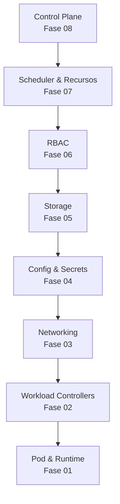

# Kubernetes — Camadas do Cluster

Bem-vindo ao repositório de estudo prático de Kubernetes, organizado **bottom-up**: cada fase explora uma camada de abstração do cluster, de dentro para fora.

## Para quem é este guia

Este repositório foi construído para quem **já operou clusters Kubernetes** (EKS, GKE, AKS) na prática, mas nunca entendeu os internals — sabe *o que fazer*, mas não *por que funcionou* nem *onde olhar quando quebra*.

O objetivo não é re-ensinar o básico. É preencher o gap entre "consegue usar" e "consegue debugar com confiança".

## O que você vai aprender

Ao final das 8 fases, você será capaz de:

- Dado um cluster com problema desconhecido, saber **por onde começar a investigar**
- Ler um YAML de qualquer recurso k8s puro e entender o que **cada campo faz e por quê**
- Explicar o que acontece no cluster entre um `kubectl apply` e o Pod ficar `Running`
- Debugar os erros mais comuns **sem consultar StackOverflow como primeira ação**

## As 8 Camadas do Cluster

A progressão garante que cada novo conceito se apoia em algo já compreendido. O debugging não é um exercício extra — é o critério de conclusão de cada fase.

## Estrutura de cada fase

Toda fase segue o mesmo formato:

| Seção | Conteúdo |
|---|---|
| **Teoria** | O que é cada recurso e como funciona internamente |
| **YAML de referência** | Campos anotados com o efeito de cada um |
| **Lab prático** | Exercício hands-on com saída esperada dos comandos |
| **Debugging** | Cluster quebrado para diagnosticar e consertar |
| **Pronto quando...** | Critério explícito de conclusão antes de avançar |

## Ambiente de prática

| Ferramenta | Fases |
|---|---|
| kind | 1 a 8 — todos os cenários, topologia real |

## Por onde começar?

Acesse o [Roadmap](roadmap.md) para ver o plano completo das 8 fases.

Depois configure seu ambiente em [Setup](setup/index.md) e comece pela [Fase 01 — Pod & Runtime](fase-01-pod-runtime/index.md).
