# Roadmap — Kubernetes Camadas do Cluster

Este roadmap é dividido em 8 fases progressivas, cada uma cobrindo uma camada de abstração do cluster. O debugging é o critério de conclusão de cada fase — não avance sem conseguir resolver o cenário sozinho.

---

## Visão Geral

```mermaid
gantt
    title Jornada Kubernetes — Camadas do Cluster
    dateFormat  X
    axisFormat Fase %s

    section Fundação
    Fase 01 - Pod & Runtime       :0, 1
    Fase 02 - Controllers         :1, 2

    section Plataforma
    Fase 03 - Networking          :2, 3
    Fase 04 - Config & Secrets    :3, 4
    Fase 05 - Storage             :4, 5

    section Segurança & Escala
    Fase 06 - RBAC                :5, 6
    Fase 07 - Scheduling          :6, 7

    section Internals
    Fase 08 - Control Plane       :7, 8
```

---

## 01. Pod & Container Runtime

**Estimativa:** ~2 semanas | **Ambiente:** kind

**Objetivo:** Entender a menor unidade do Kubernetes e como o kubelet gerencia o ciclo de vida dos containers.

- [ ] [Pod](fase-01-pod-runtime/pod.md) — estrutura, campos essenciais, ciclo de vida
- [ ] [Namespaces](fase-01-pod-runtime/namespace.md) — isolamento lógico de recursos
- [ ] [InitContainers](fase-01-pod-runtime/init-containers.md) — pré-condições antes do container principal
- [ ] [Probes](fase-01-pod-runtime/probes.md) — liveness, readiness e startup probes

**Lab:** iniciar um Pod com initContainer, inspecionar com `kubectl describe`, `kubectl logs`, `kubectl exec`.

**Critério de conclusão:** Conseguir identificar e corrigir um `CrashLoopBackOff` sem consultar material externo.

---

## 02. Workload Controllers

**Estimativa:** ~3 semanas | **Ambiente:** kind

**Objetivo:** Entender como o Kubernetes garante que a carga de trabalho desejada esteja sempre rodando.

- [ ] [Deployment](fase-02-workload-controllers/deployment.md) — rolling update, rollback, ReplicaSet
- [ ] [StatefulSet](fase-02-workload-controllers/statefulset.md) — identidade estável, PVC por Pod
- [ ] [DaemonSet](fase-02-workload-controllers/daemonset.md) — um Pod por nó
- [ ] [Job & CronJob](fase-02-workload-controllers/job-cronjob.md) — execuções únicas e agendadas

**Lab:** fazer rolling update de um Deployment, acompanhar com `kubectl rollout status`, executar rollback com `kubectl rollout undo`.

**Critério de conclusão:** Conseguir executar rollback e explicar o que o ReplicaSet antigo (com 0 réplicas) estava fazendo.

---

## 03. Networking

**Estimativa:** ~3 semanas | **Ambiente:** kind

**Objetivo:** Entender como Pods se comunicam entre si e como o tráfego externo chega ao cluster.

- [ ] [Services](fase-03-networking/services.md) — ClusterIP, NodePort, LoadBalancer, Endpoints
- [ ] [Ingress](fase-03-networking/ingress.md) — roteamento HTTP/HTTPS por host e path
- [ ] [NetworkPolicy](fase-03-networking/network-policy.md) — firewall declarativo entre Pods
- [ ] [DNS Interno](fase-03-networking/dns.md) — CoreDNS e resolução de nomes

**Lab:** criar Service ClusterIP, fazer `kubectl exec` em um Pod e usar `curl` para acessar outro Pod via nome DNS.

**Critério de conclusão:** Conseguir diagnosticar um Service com Endpoints vazio e corrigir o seletor de label sem ajuda.

---

## 04. Configuração & Segredos

**Estimativa:** ~2 semanas | **Ambiente:** kind

**Objetivo:** Separar configuração do código e injetar dados sensíveis de forma segura.

- [ ] [ConfigMap](fase-04-config-secrets/configmap.md) — configuração não-sensível
- [ ] [Secret](fase-04-config-secrets/secret.md) — dados sensíveis em base64
- [ ] [Injeção em Pods](fase-04-config-secrets/injection.md) — env, envFrom e volumes

**Lab:** criar um ConfigMap com arquivo de configuração, montá-lo como volume e observar a propagação automática ao atualizar.

**Critério de conclusão:** Conseguir injetar configuração via env e via volume sem consultar documentação.

---

## 05. Storage

**Estimativa:** ~2 semanas | **Ambiente:** kind

**Objetivo:** Entender como o Kubernetes abstrai armazenamento persistente e temporário.

- [ ] [PV e PVC](fase-05-storage/pv-pvc.md) — ciclo de vida do armazenamento persistente
- [ ] [StorageClass](fase-05-storage/storage-class.md) — provisionamento dinâmico
- [ ] [Volumes Temporários](fase-05-storage/temp-volumes.md) — emptyDir e hostPath

**Lab:** criar um StatefulSet com PVC, escrever dados, deletar o Pod e confirmar que os dados persistem no Pod recriado.

**Critério de conclusão:** Conseguir diagnosticar um PVC em Pending e entender a diferença entre provisionamento estático e dinâmico.

---

## 06. Controle de Acesso (RBAC)

**Estimativa:** ~2 semanas | **Ambiente:** kind

**Objetivo:** Entender como o Kubernetes controla quem pode fazer o quê no cluster.

- [ ] [ServiceAccount](fase-06-rbac/service-account.md) — identidade de um Pod na API
- [ ] [Role e ClusterRole](fase-06-rbac/roles.md) — conjuntos de permissões
- [ ] [Bindings](fase-06-rbac/bindings.md) — vinculando permissões a identidades

**Lab:** criar uma ServiceAccount com Role de leitura apenas, rodar um Pod usando essa SA e confirmar que não consegue criar recursos.

**Critério de conclusão:** Conseguir investigar um `403 Forbidden` e descobrir qual verbo/recurso está faltando no Role.

---

## 07. Scheduling & Recursos

**Estimativa:** ~3 semanas | **Ambiente:** kind multi-nó

**Objetivo:** Entender como o scheduler decide onde colocar Pods e como controlar o consumo de recursos.

- [ ] [Requests e Limits](fase-07-scheduling/resources.md) — reserva e teto de recursos
- [ ] [LimitRange e Quota](fase-07-scheduling/limitrange-quota.md) — defaults e tetos por namespace
- [ ] [Taints e Tolerations](fase-07-scheduling/taints.md) — repelir e tolerar restrições de nó
- [ ] [Affinity](fase-07-scheduling/affinity.md) — co-localização e anti-afinidade
- [ ] [HPA](fase-07-scheduling/hpa.md) — escalonamento automático horizontal

**Lab:** aplicar LimitRange, adicionar taint em um nó e confirmar que o Pod fica Pending até adicionar a toleration correta.

**Critério de conclusão:** Conseguir diagnosticar um Pod em Pending e determinar se o problema é de recursos, taint ou affinity.

---

## 08. Internals do Control Plane

**Estimativa:** ~3 semanas | **Ambiente:** kind multi-nó

**Objetivo:** Entender o que acontece por dentro do cluster: quem faz o quê e em qual ordem.

- [ ] [Componentes](fase-08-control-plane/components.md) — apiserver, etcd, scheduler, controller-manager, kubelet, kube-proxy
- [ ] [Fluxo de Criação](fase-08-control-plane/pod-flow.md) — do `kubectl apply` ao Pod `Running`
- [ ] [Debugging](fase-08-control-plane/debugging.md) — nó NotReady, apiserver sem resposta, ContainerCreating

**Lab:** inspecionar componentes com `kubectl get pods -n kube-system`, acompanhar eventos de criação de Pod, simular nó NotReady.

**Critério de conclusão:** Conseguir listar os componentes, ver seus logs e explicar o papel de cada um em um incidente de nó NotReady.

---

## Critérios Globais de Conclusão

Ao final das 8 fases:

- [ ] Dado um cluster com problema desconhecido, você sabe por onde começar
- [ ] Você lê qualquer YAML de recurso k8s e entende o que cada campo faz
- [ ] Você explica o que acontece entre `kubectl apply` e o Pod ficar `Running`
- [ ] Você debuga os erros mais comuns sem abrir o StackOverflow como primeira ação

---

## Próximos Passos

Após completar as 8 fases, você estará pronto para explorar:

- **Helm / Kustomize** — gestão de templates e configuração por ambiente
- **ArgoCD / GitOps** — entrega contínua declarativa
- **Prometheus / Grafana** — observabilidade e alertas
- **Vault** — gestão externa de segredos
- **Service Mesh (Istio/Linkerd)** — observabilidade e segurança de rede
